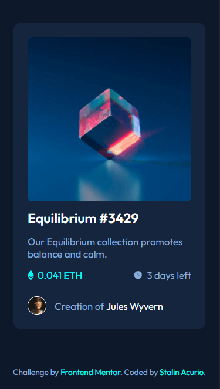
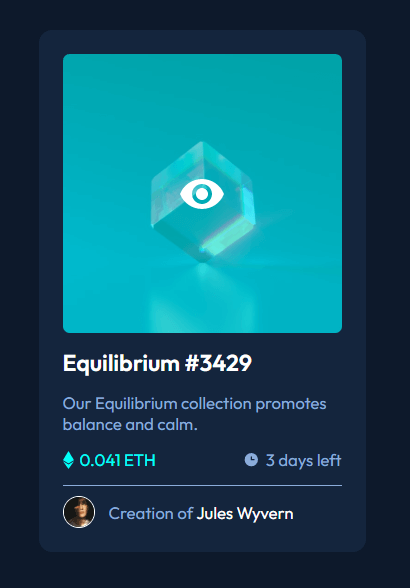

# NFT-PreviewCard
Solution to the NFT preview card component challenge on Frontend Mentor.

# Frontend Mentor - NFT preview card component solution

This is a solution to the [NFT preview card component challenge on Frontend Mentor](https://www.frontendmentor.io/challenges/nft-preview-card-component-SbdUL_w0U). Frontend Mentor challenges help you improve your coding skills by building realistic projects. 

## Table of contents

- [NFT-PreviewCard](#nft-previewcard)
- [Frontend Mentor - NFT preview card component solution](#frontend-mentor---nft-preview-card-component-solution)
  - [Table of contents](#table-of-contents)
    - [Screenshot](#screenshot)
    - [Links](#links)
  - [My process](#my-process)
    - [Built with](#built-with)
    - [What I learned](#what-i-learned)
  - [Author](#author)

### Screenshot





### Links

- Solution URL: [GitHub](https://github.com/StalinAM/NFT-PreviewCard.git)
- Live Site URL: [StalinAM](https://stalinam.github.io/NFT-PreviewCard/)

## My process

### Built with

- Semantic HTML5 markup
- CSS custom properties
- CSS Grid
- Mobile-first workflow
- Responsive web design

### What I learned

Use of hover to change opacity and place an image on top of another image.

```html
<picture class="img-container">
    
    
</picture>
```

```css
.img-container {
    display: flex;
    justify-content: center;
    align-items: center;
    background-color: var(--Cyan);
    border-radius: 7px;
}

#secondary-image {
    position: absolute;
    display: none;
}

.img-container #primary-image:hover {
    opacity: 0.4;
}

#primary-image:hover+#secondary-image {
    display: flex;
}
```

## Author

- GitHub - [StalinAM](https://github.com/StalinAM)
- Frontend Mentor - [@StalinAM](https://www.frontendmentor.io/profile/StalinAM)